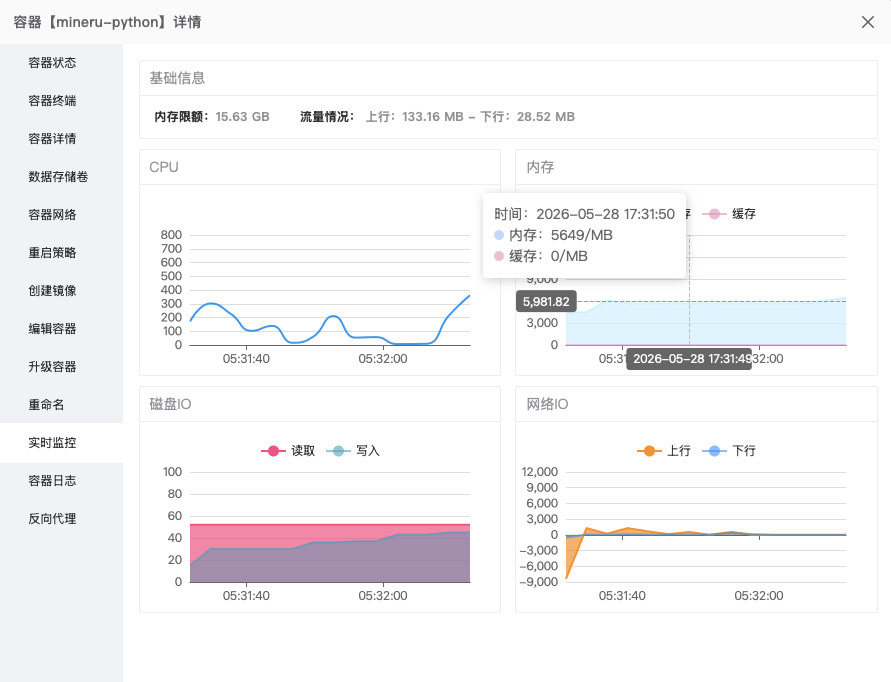
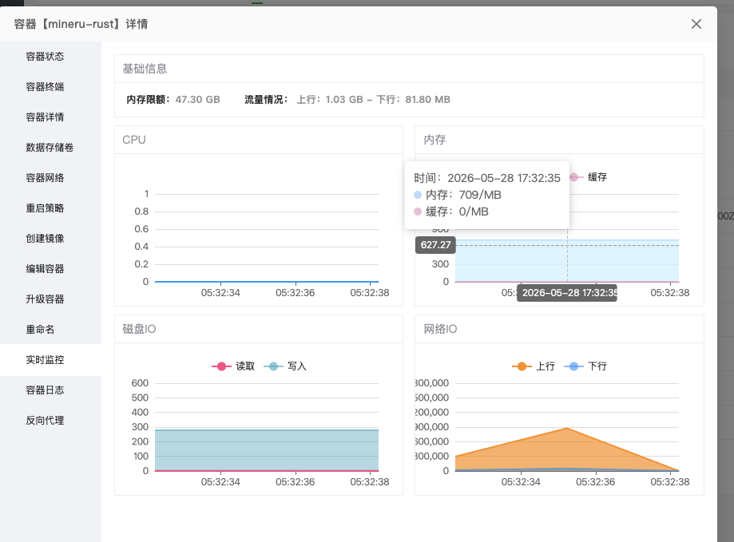
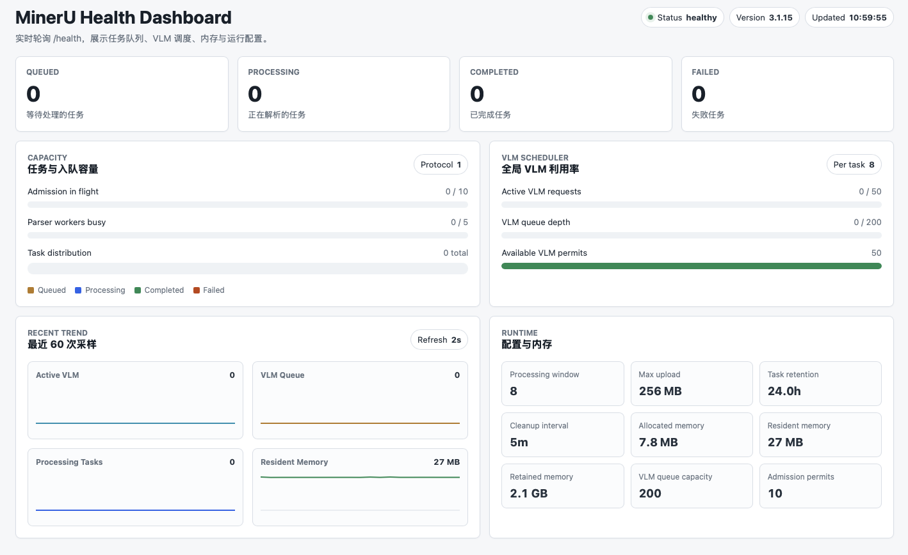

# MinerU Rust API Server
## 项目简介

这是官方 Python 包 `mineru-api` 的 Rust 版本实现，提供兼容的 API 接口和相近的解析 Pipeline，用于通过 OpenAI-compatible VLM 服务解析 PDF 和图片文件，并用纯 Rust OOXML 解析器支持 `docx`、`pptx`、`xlsx` Office 文件。注意，PDF/图片解析只支持**vlm-http-client**!

Office 支持范围限定为 OOXML 格式：`docx`、`pptx`、`xlsx`。旧二进制 Office 格式 `doc`、`ppt`、`xls` 不支持；如需解析旧格式，请先在外部转换为 OOXML。

官方 Python 包至3.1.7版本，仍然存在解析数十个文档后，内存占用持续增长且不会回落的问题，同时仍存在2.X.X版本可能的内存泄漏问题。

Rust 版本重点优化长时间运行的稳定性、内存占用和部署体验。本项目在同批文档解析场景下峰值内存通常可稳定在 1GB 左右，主要内存占用来自 PDF 渲染库。

同时，本项目提供：

- 二进制编译后一键运行
- Docker 镜像部署
- 更丰富的并发和资源配置项
- `/health/ui` 可视化监控界面
- Office OOXML 文本、标题、表格、图片、基础公式/超链接解析输出

**Python 版本内存占用**



**Rust 版本内存占用**



**Rust 版本监控界面**



## Rust 编译后运行

### 1. 准备配置

```bash
cp .env.example .env
```

按实际环境编辑 `.env`。

- VLM 服务：`MINERU_VL_SERVER=http://XXX.XXX.XXX.XXX:XXX`,也可不设置，在调用file_parse接口时传参设置。
- 生产环境显式设置 `MINERU_VL_MODEL_NAME`时，可跳过 `/v1/models` 探测

任务输出默认写入 `.env` 中的 `MINERU_API_OUTPUT_ROOT=./output`。

### 2. 编译二进制

```bash
cargo build --release
```

编译产物位于：

```text
target/release/mineru-rust
```

### 3. 启动服务

```bash
./target/release/mineru-rust --host 127.0.0.1 --port 34001
```

服务启动后访问：

```bash
curl http://127.0.0.1:34001/health/ui
```

常用入口：

- API 文档：`http://127.0.0.1:34001/docs`
- 监控界面：`http://127.0.0.1:34001/health/ui`

## Docker 部署

镜像不会把 `.env` 打包进去。请在运行容器时使用 Docker 的 `--env-file` 注入配置。

当前 Dockerfile 会复制本地已编译好的 `target/release/mineru-rust`，因此构建镜像前需要先完成 release 编译。

### 1. 准备配置

```bash
cp .env.example .env
```

如果 VLM 服务运行在宿主机：

- Docker Desktop: `MINERU_VL_SERVER=http://host.docker.internal:30000`
- Linux bridge 网络: 使用宿主机可被容器访问的 IP，例如 `http://172.17.0.1:30000`
- Linux host 网络: 可继续使用 `http://127.0.0.1:30000`，运行容器时加 `--network host`

容器默认工作目录是 `/app`，Dockerfile 中默认设置：

```text
MINERU_API_OUTPUT_ROOT=/app/output
```

运行容器时建议把 `/app/output` 挂载到宿主机目录，方便保留上传文件、中间结果和解析输出。
容器启动入口会自动创建并授权 `MINERU_API_OUTPUT_ROOT` 指向的目录，避免挂载宿主机空目录后非 root 服务进程无法写入。

### 2. 构建二进制和镜像

```bash
cargo build --release
docker build -t mineru-rust:latest .
```

### 3. 启动容器

普通 bridge 网络：

```bash
docker run --rm \
  --name mineru-rust \
  --env-file .env \
  -p 34001:34001 \
  -v "$PWD/output:/app/output" \
  mineru-rust:latest
```

Linux host 网络：

```bash
docker run --rm \
  --name mineru-rust \
  --env-file .env \
  --network host \
  -v "$PWD/output:/app/output" \
  mineru-rust:latest
```

服务启动后访问：

```bash
curl http://127.0.0.1:34001/health/ui
```

`--env-file .env` 会把运行时配置注入容器；`-v "$PWD/output:/app/output"` 会把容器内输出目录映射到当前目录下的 `output/`。

## 配置优先级

Dockerfile 只提供容器内默认输出目录：

```text
MINERU_API_OUTPUT_ROOT=/app/output
```

运行时 `--env-file .env` 会覆盖镜像内默认环境变量；也可以继续用 `-e KEY=value` 覆盖 `.env` 中的单项配置。

程序启动时也会尝试读取当前工作目录下的 `.env`。Docker 部署时推荐使用 `--env-file` 传入环境变量，而不是把 `.env` 复制进镜像。

## VLM 并发调优

服务端使用全局 VLM worker 队列调度所有解析任务的 VLM 请求：

- `MINERU_VLM_MAX_CONCURRENCY`: 全局同时发送到 VLM 服务的请求数。
- `MINERU_VLM_QUEUE_CAPACITY`: 等待 VLM worker 的有界队列容量。
- `MINERU_VLM_MAX_REQUESTS_PER_TASK`: 单个任务同时排队/发送的 VLM 请求上限，防止大文档独占队列。
- `MINERU_API_MAX_CONCURRENT_REQUESTS`: 同时进入解析执行态的文档数。排队文件很多但 VLM 不满载时，可以在内存允许的前提下提高到 8-16。

可通过 `/health` 或 `/health/ui` 观察 `active_vlm_requests`、`vlm_queue_depth`、`vlm_queue_capacity` 和 `available_vlm_permits` 判断瓶颈。如果 `active_vlm_requests` 长期低于 `MINERU_VLM_MAX_CONCURRENCY` 且队列为空，通常说明 PDF 渲染、图片裁剪或解析任务数不足；如果队列长期接近满，说明 VLM 服务本身是瓶颈。
